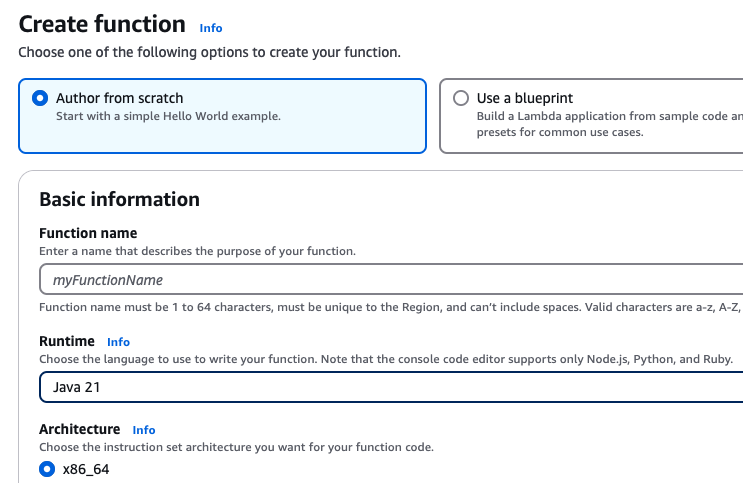
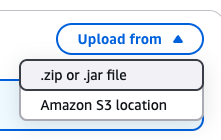

### AWS Lambda

``` groovy 

    implementation 'com.amazonaws:aws-lambda-java-core:1.2.2'
    implementation 'com.amazonaws:aws-lambda-java-events:3.11.1'

```

`Request` and `Response` are the classes that you create that get sent as and returned as JSON.

``` java 
public class HelloRequestHandler implements RequestHandler<APIGatewayProxyRequestEvent, Response> {

    @Override
    public Response handleRequest(APIGatewayProxyRequestEvent event, Context context) {
        String body = event.getBody();
        Gson gson = new Gson();
        Request request = gson.fromJson(body, Request.class);
        // do something with the request
        return new Response();
    }
}
```

## Checkstyles and JSON Variables

If a variable contains underscores which will fail checkstyles, you can disable checkstyles by wrapping the code in
comments.

``` java 
    //CHECKSTYLE:OFF
    public String station_id;
    //CHECKSTYLE:ON
```

## Uploading to AWS Lambda

You need to create a jar file of your code that has all the dependencies in it. This is known as a "fat jar".

Copied from https://www.baeldung.com/gradle-fat-jar

In build.gradle put this at the **top** of the file.

``` groovy
buildscript {
    dependencies {
        classpath "gradle.plugin.com.github.johnrengelman:shadow:7.1.2"
    }
}
```

Then add this to the `plugins` block.

``` groovy
  id 'com.github.johnrengelman.shadow' version '7.1.2'
```

Then you can run the `shadowJar` gradle task and create a jar file that has the code and dependencies.

``` bash 
./gradlew shadowJar
```

This will create a jar file in `build/libs/`

## Creating the Lambda on AWS



Create a Lambda. Give a name Function Name and set the Runtime to Java 21



In the `Code` tab, click the "Upload from" button and find the jar file you created.

In the `Configuration` tab, create a `Functional URL` and make sure you set the Auth Type to NONE.

## Testing your Lambda on AWS

You can test your lambda after uploading it by running the following command where `request.json` is a file containing
the json you want to send and `urlToYourLambda` is the functional url created by AWS to your lambda.

``` bash 

curl -X POST \
     -v \
     -H "Content-Type: application/json" \
     -d @request.json \
     urlToYourLambda

```