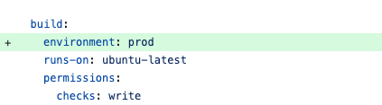
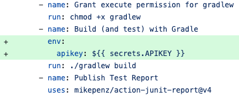

### API Keys

An apikey is a "password" that an online api will give you when you sign up. The key needs to be passed to the server in
each request. **API keys must NEVER be checked into GitHub.**

#### Storing Api Keys Locally (Unit Tests and your application)

1. Make sure your `.gitignore` includes this line

``` gitignore
**/apikey.properties
```

2. Create a file `src/main/resources/apikey.properties` in your project. This file will **NOT** be checked into GitHub.

```
apikey=ApiKeyGivenToYouByTheApiWhenYouSignUp
```

3. Add ApiKey.java which you can use to retrieve the key

``` java
/**
 * Retrieve the API Key in apikey.properties or from environment variable on GitHub
 */
public class ApiKey {

    private final String key;

    public ApiKey() {
        Properties properties = new Properties();
        InputStream in = ApiKey.class.getResourceAsStream(
                "/apikey.properties");
        if (in != null) {
            try {
                properties.load(in);
                key = properties.getProperty("apikey");
            } catch (IOException e) {
                throw new RuntimeException(e);
            }
        } else {
            key = System.getenv("apikey");
        }

        if (key == null) {
            throw new NullPointerException("apikey is null");
        }
    }

    @Override
    public String toString() {
        return key;
    }
}
```

#### Storing the API Key on GitHub (Unit Tests)

1. Open your Repository on GitHub and Go to `Settings`
2. On the left side there's a tab for `Environment`. Add a new Environment called "prod".
3. In `Secrets and Variables` add a new Environment Secret called `APIKEY`. The value should be the apikey that was
   given to you by the api.
4. Make the following changes to your `java_gradle.yaml` file

Add `environment: prod`



Add the Secret API Key

```
env:
    apikey: ${{ secrets.APIKEY }}
```


