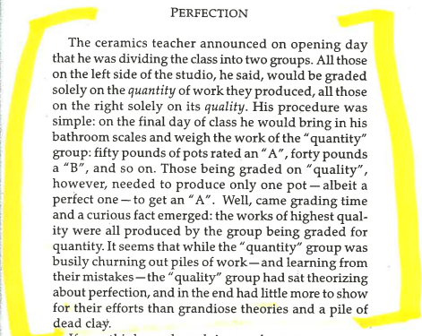

### Art and Fear

This is a excerpt from the book [Art and Fear](http://www.amazon.com/Art-Fear-Observations-Rewards-Artmaking/dp/0961454733)

As you go through this book, there will be challenge problems with analysis afterwards. Work on the problems, the way you get better at this is by "quantity". Make a decision right now, that your intention is to go for the "50 pounds of pottery".

