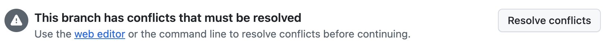

### Merge Conflicts

When you are not allowed to merge your PR you must handle merge conflicts.



While on your branch you are going to pull the changes from `main` into your branch.

``` bash
git pull origin main
```

This will cause merge tags to be inserted in files where git doesn't know what the correct code is.

```
>>>>>> HEAD

// here is some code

=====

// here is some other code

<<<<<<
```

You must remove this tags and replace it with ONLY the correct code.

After you resolve **ALL** conflicts in **ALL** files, add the files to git

``` bash
git add .
```

Then commit the changes **without a commit message**. This will add a generated commit message automatically that shows
what files were conflicted.

``` bash
git commit --no-edit
```

Then push your changes to your branch. This will update your PR and make it mergeable.