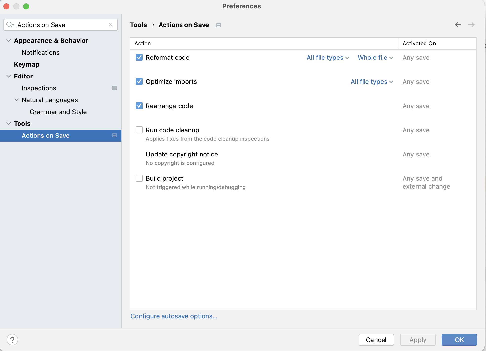

1. Update to the latest version of [IntelliJ](https://www.jetbrains.com/idea/) **COMMUNITY EDITION** 2023.1.2
2. Update to the latest version of [Java](https://www.youtube.com/watch?v=3OA_ydMlPvw) 20
3. Configure [Actions on Save](https://www.jetbrains.com/help/idea/saving-and-reverting-changes.html#actions-on-save)
   
4. Add [Live Template](https://www.jetbrains.com/help/idea/using-live-templates.html) for "given"
   