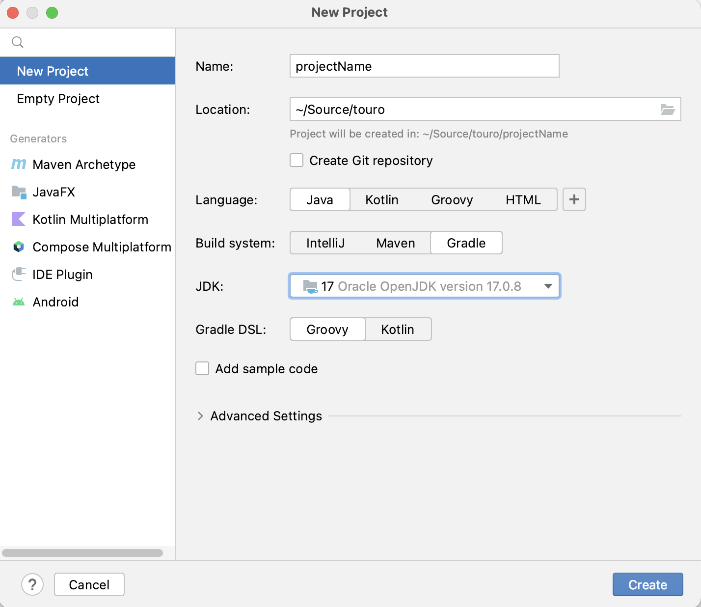

### Creating a new Java Gradle Project

1. Create a new project in IntelliJ

Add a name then choose the following options.

      Language : Java
      
      Build System : Gradle
      
      Gradle DSL : Groovy

2. Add a [.gitignore](.gitignore) to the root of your project.

3. Open a terminal inside the project (or use the terminal tab in Intellij)

        # this makes the project into a git repo
        git init

        # tell git your name
        git config --global user.name "FIRST_NAME LAST_NAME"

        # tell git your email
        git config user.email "MY_NAME@example.com"
        
        # renames master to main
        git branch -m master main

        # adds all files to git
        git add .

        # commits all files that have been added
        git commit -m "initial commit"

1. Create a new repository on GitHub

5. Add the repository as a remote with the SSH url (it should start with git@github)

         git remote add origin [ssh url]
         git push origin main

### Now you are ready to start working.
