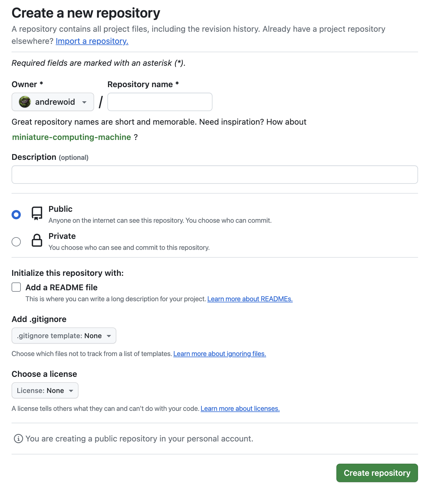
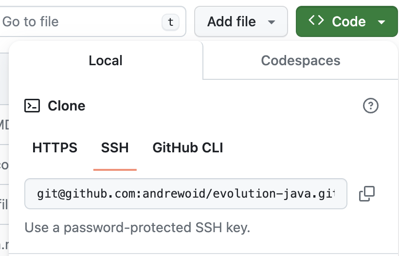

## Creating a new Java Gradle Project

### 1. Create a new project in IntelliJ


Add a name then choose the following options.

      Language : Java
      
      Build System : Gradle
      
      Gradle DSL : Groovy

### 2. Add these lines to a file called `.gitignore` in the root of your project.

``` gitignore 

.idea/
out/
.gradle/
build/
.DS_STORE
**/apikey.properties

```

### 3. Download configuration files for how Github handles your project.

``` bash
# This file is displayed when you go to your Github at the bottom of the page
# Edit the *Markdown* file with information on your project
curl -o README.md https://raw.githubusercontent.com/andrewoid/evolution-java/main/git/.github/README.md

# These directories are user for Github parameters
mkdir -p .github/workflows/

# This file controls running unit tests and checkstyles in PRs
curl -o .github/workflows/java_gradle.yaml https://raw.githubusercontent.com/andrewoid/evolution-java/main/git/.github/workflows/java_gradle.yaml

# This file controls the style that gets checked by checkstyles.
curl -o .github/workflows/checkstyle.xml https://raw.githubusercontent.com/andrewoid/evolution-java/main/git/.github/workflows/checkstyle.xml

# This file is a template for your PRs.
curl -o .github/pull_request_template.md https://raw.githubusercontent.com/andrewoid/evolution-java/main/git/.github/pull_request_template.md
```

Here is
a [Markdown tutorial](https://docs.github.com/en/get-started/writing-on-github/getting-started-with-writing-and-formatting-on-github/basic-writing-and-formatting-syntax)
for writing README.md

### 4. Open a terminal inside the project (or use the terminal tab in Intellij)

If this is the first time you are using git, run these commands to identify yourself.

``` bash
# tell git your name
git config --global user.name "FIRST_NAME LAST_NAME"

# tell git your email
git config user.email "MY_NAME@example.com"
```

Otherwise, continue with these steps.

``` bash 
# this makes the project into a git repo
git init

# renames master to main
git branch -m master main

# adds all files to git
git add .

# commits all files that have been added
git commit -m "initial commit"   
```

### 5. Create a new repository on GitHub



### 6. Add the repository as a remote with the SSH url (it should start with git@github)



```bash 

git remote add origin [ssh url]

```

### 7. Upload the files to github.

``` bash 
git push origin main
```

### Now you are ready to [start working](git_and_github.md).
