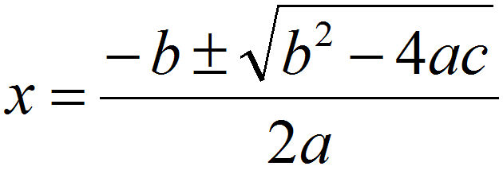

### Quadratic Equation

Create a class called QuadraticEquation

    class QuadraticEquation {
    
        public QuadraticEquation(double a, double b, double c) { ... }
    
        public double getPositiveX() { ... }
        public double getNegativeX() { ... }
    
    }
    
Create a class called QuadraticEquationTest and write two tests to test the getPositiveX() and getNegativeX() methods. 

What should happen if a == 0 or b == 0?