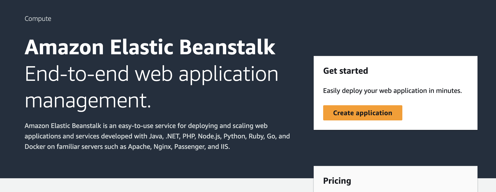
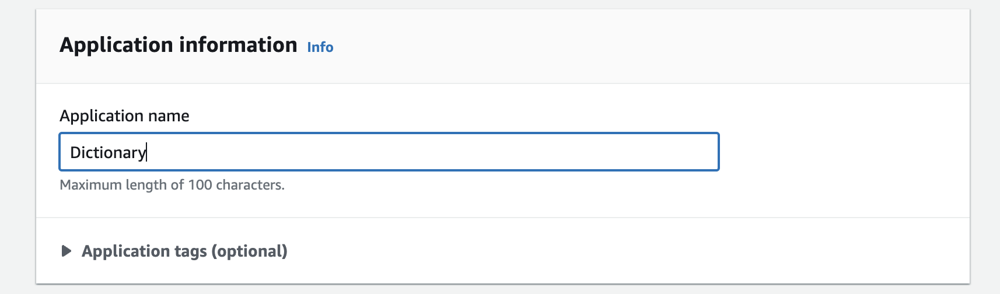
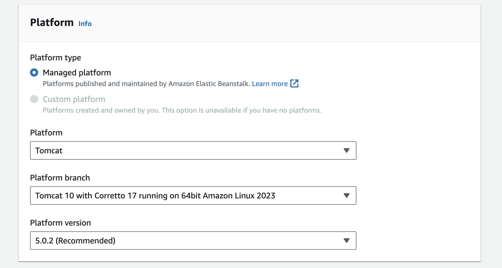
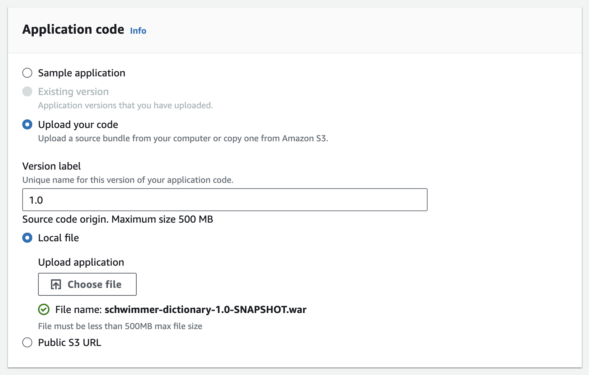
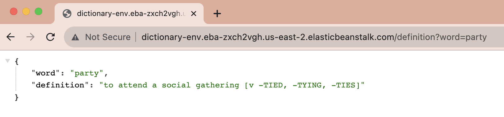

### Upload War to Amazon AWS

Log into AWS [Elastic Beanstalk](https://aws.amazon.com/elasticbeanstalk/)

Create a new application

Choose a name for your application

Choose the Tomcat 10 platform

Upload the war file

Click Next and Submit on the rest of the screens. Wait a few minutes for AWS to load.

Load up your application in a browser with the URL created by AWS.

