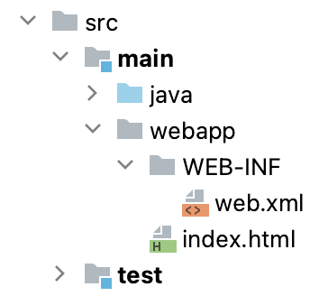

### Tomcat

[Apache Tomcat](https://tomcat.apache.org/) is a standalone webserver that you can run on your local machine. In order to add your Servlet to Tomcat you need to create a war file.

Gradle can be set up to create [war files](https://docs.gradle.org/current/userguide/war_plugin.html). These files can also be uploaded to Amazon AWS or Google Cloud later.

#### Download Tomcat

[Download](https://tomcat.apache.org/download-10.cgi) the zip version of Tomcat 10.

Unzip the contents into any directory.

The two important directories for us are `bin` and `webapps`.

Mac/Linux: To make tomcat runnable, navigate to the `bin` directory and run 

``` bash
chmod +x startup.sh shutdown.sh catalina.sh
```

In order to run Tomcat, go into the `bin` directory and run `startup.bat` (Windows) `./startup.sh` (Mac/Linux). If you want to shut down Tomcat run `shutdown.bat` or `./shutdown.sh`

You can verify that Tomcat is started by going to http://localhost:8080

### Project Configuration

- Add to `plugins` in `build.gradle`
```
id 'war'
```

- Create a `webapp` directory in `main`. This is where public HTML files will go.

- Create a `WEB-INF` directory in `webapp`. This is where private files will go.

- Create `web.xml` in `WEB-INF` directory. This is a configuration file.
    - `index.html` is the first web page displayed to the user.
    - Use a `display-name`, `servlet-name`, `servlet-class` and `url-pattern` unique to your project.

``` html

<web-app xmlns="http://xmlns.jcp.org/xml/ns/javaee"
         xmlns:xsi="http://www.w3.org/2001/XMLSchema-instance"
         xsi:schemaLocation="http://xmlns.jcp.org/xml/ns/javaee
         http://xmlns.jcp.org/xml/ns/javaee/web-app_3_1.xsd"
         version="3.1">

    <welcome-file-list>
        <welcome-file>index.html</welcome-file>
    </welcome-file-list>

    <servlet>
        <display-name>Display Name</display-name>
        <servlet-name>Servlet Name</servlet-name>
        <servlet-class>full.package.path.to.Servlet</servlet-class>
    </servlet>

    <servlet-mapping>
        <servlet-name>Servlet Name</servlet-name>
        <url-pattern>/servletName</url-pattern>
    </servlet-mapping>

</web-app>

```

This is what your directory structure should look like.


### Deploying to Tomcat

In terminal run

` ./gradlew war `

If it is successful you should see a war file in the `build/libs` directory of your IntelliJ project.

To deploy it to Tomcat, run this command. 

Windows
`copy build/libs/*.war /path/to/tomcat/webapps`

Mac/Linux
`cp build/libs/*.war /path/to/tomcat/webapps`

Your webapp should be available at http://localhost:8080/Project/servletName

If something doesn't work you can look at a log file located in the `logs` directory